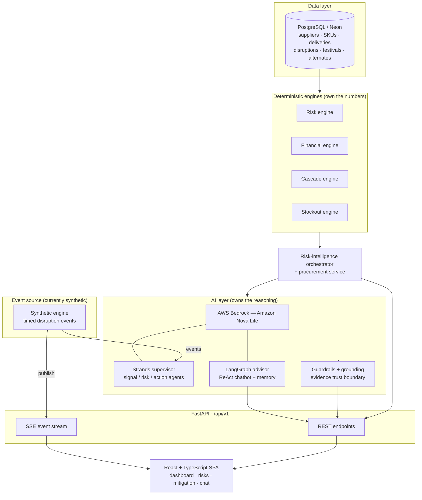

# SupplySense

**AI-driven supply-chain disruption prediction & prescriptive mitigation for Indian retail.**

SupplySense continuously scores supplier risk, forecasts stockouts, quantifies financial exposure in ₹, maps sub-tier dependency blast radius, and — most importantly — **recommends the specific mitigation action that fits each situation** (switch supplier, expedite, buffer stock, substitute SKU, or reorder), with an AI advisor you can ask "what-if" questions in plain language.

> **⚠️ Data notice:** This version runs entirely on **deterministic seed data** (see [`backend/seeders/seed_min10.py`](backend/seeders/seed_min10.py)) — 10 suppliers with engineered disruption scenarios. Live event ingestion is simulated by a synthetic engine. The system is architected so real feeds (see [Scaling & Future Development](#-scaling--future-development)) plug into the same pipeline without redesign.

---

## Table of contents

- [Overview](#overview)
- [Key features](#key-features)
- [System architecture](#system-architecture)
- [Tech stack](#tech-stack)
- [Project structure](#project-structure)
- [Getting started](#getting-started)
- [How it works — the AI trust boundary](#how-it-works--the-ai-trust-boundary)
- [Scaling & future development](#-scaling--future-development)
- [Contributors](#contributors)

---

## Overview

Retail procurement teams lose money when a supplier disruption (a cyclone, a labour strike, an FSSAI quality hold, a demand surge) turns into a stockout before anyone acts. SupplySense is a decision-intelligence platform that:

1. **Detects & scores risk** per supplier from delivery history, active disruptions, inventory pressure, dependency exposure and festival/seasonal demand.
2. **Quantifies the money at stake** (Total Financial Exposure) in Indian Rupees — deterministically and auditably.
3. **Designs a fitted mitigation plan** — the deterministic engine prices every option, while AI selects *which* actions fit the specific scenario and writes the reasoning. Numbers come from engines; narrative comes from AI. Neither crosses the line.
4. **Answers questions conversationally** — a LangGraph tool-using advisor lets a manager ask "how exposed are we if Dakshin is disrupted?" and get a grounded, multi-step answer over live data.

The design principle throughout: **AI reasons; deterministic engines own the numbers.** Every rupee figure is engine-computed and grounding-checked, so the AI can never fabricate a financial value.

## Key features

| Feature | What it does |
|---|---|
| **Risk intelligence** | Multi-factor supplier risk scoring with trend history |
| **Financial exposure engine** | ₹-denominated TFE: revenue at risk, SLA penalties, stockout cost |
| **Stockout forecasting** | Days-to-stockout per SKU with critical/high classification |
| **Cascade / blast-radius** | Recursive n-tier dependency propagation |
| **Scenario-fit mitigation** | Situation-aware recommendation (switch / expedite / stock / substitute / reorder), priced by the engine, chosen & narrated by AI |
| **Conversational advisor** | LangGraph ReAct chatbot with 8 read-only tools + multi-turn memory |
| **Multi-agent pipeline** | Strands supervisor (signal → risk → action agents) processes disruption events |
| **Live event stream** | Server-Sent Events push disruption alerts to the UI in real time |
| **Guardrails & grounding** | Prompt-injection/leak filters, Pydantic output contracts, rupee-figure grounding |

## System architecture



**Request flow (example — a mitigation plan):**

1. The UI requests a supplier's mitigation plan from FastAPI (`/api/v1/...`).
2. `RiskIntelligenceService` gathers the live scenario from Postgres (exposure, days of cover, disruption type, demand multiplier, real alternate economics).
3. The **financial engine** builds a *scenario-fit* option set and prices each option deterministically.
4. The **AI layer** (Bedrock) selects which viable actions fit and writes the reasoning — constrained by the engine's viable set and a no-fabrication system prompt.
5. **Grounding** rejects any rupee figure the AI wasn't given; the response is assembled with engine numbers + AI narrative and returned.
6. Disruption events flow separately through the **Strands supervisor** and are pushed to the UI over **SSE**.

## Tech stack

| Layer | Technologies |
|---|---|
| **Frontend** | React 18, TypeScript, Vite, TanStack Query, React Router 7, Tailwind CSS + shadcn, lucide-react, MapLibre GL / react-simple-maps, Recharts |
| **Backend** | Python, FastAPI, SQLAlchemy (async) + asyncpg, Pydantic / pydantic-settings, sse-starlette |
| **AI / Agents** | AWS Bedrock (Amazon Nova Lite), LangGraph (conversational advisor), Strands Agents SDK (event supervisor), LangChain-AWS |
| **Database** | PostgreSQL (Neon serverless), Alembic migrations |
| **Cloud** | AWS Bedrock (inference), Neon (managed Postgres); SQS/S3 provisioned for the future event backbone |
| **Tooling** | pytest, pyflakes, TruffleHog + Gitleaks (secret-scan CI) |


## Getting started

### Prerequisites
- Python 3.11+, Node.js 18+
- A PostgreSQL database (e.g. a free Neon project)
- AWS credentials with Bedrock access to Amazon Nova Lite

### 1. Backend

```bash
cd backend
python -m venv .venv && source .venv/bin/activate
pip install -r requirements.txt
```

Create `backend/.env` (never commit this file — it is git-ignored):

```env
# backend/.env — fill with YOUR values; do not commit
DATABASE_URL=postgresql+asyncpg://<user>:<password>@<host>/<db>
AWS_REGION=ap-south-1
AWS_ACCESS_KEY_ID=<your-key>
AWS_SECRET_ACCESS_KEY=<your-secret>
BEDROCK_MODEL_ID=amazon.nova-lite-v1:0
# Optional: route the high-stakes planning call to a stronger model when available
# BEDROCK_PLANNING_MODEL_ID=
```

Seed the database and run the API:

```bash
python -m seeders.seed_min10        # ⚠️ drops & rebuilds the public schema, then seeds
uvicorn app.main:app --reload --port 8000
```

API docs: `http://localhost:8000/docs` · Health: `http://localhost:8000/api/v1/health`

### 2. Frontend

```bash
cd frontend
npm install
npm run dev            # http://localhost:5173
```

## How it works — the AI trust boundary

SupplySense deliberately separates two responsibilities so AI output is always safe to show a CFO:

- **Deterministic engines own every number.** Risk scores, ₹ exposure, option costs, savings and timelines are computed in auditable Python — never by the model.
- **AI owns reasoning & language.** It selects which mitigation actions physically fit the scenario, and writes the explanation.
- **The boundary is enforced.** Pydantic contracts (`extra="forbid"`) reject unexpected fields; a grounding check rejects any rupee amount the AI wasn't explicitly given; input/output guardrails block prompt-injection and prompt-leaks. If Bedrock is unreachable, the whole app degrades consistently to a deterministic fallback — the UI never shows "AI online" and "AI offline" at the same time.

## 🚀 Scaling & future development

The current build proves the intelligence layer on seed data. The roadmap turns it into a live, real-time platform:

- **SAP integration (primary).** Replace seed data with **live SAP endpoints** — SAP ERP / S/4HANA and Ariba APIs for real supplier master data, purchase orders, ASNs, delivery/goods-receipt history and inventory — so risk and exposure are computed on the organisation's actual procurement data.
- **Event-driven backbone.** Promote the in-process event bus to a durable broker (SQS/SNS or Kafka), replacing the synthetic engine with real connectors (news/GDELT, weather, logistics/AIS) and making decisioning reactive rather than polled.
- **Anomaly detection.** Statistical/ML detection on lead-time, ETA and demand deviation to predict disruptions *before* stockout.
- **Durable state & audit.** Move sessions, caches and the chat checkpointer to Postgres/Redis; persist every AI recommendation with its evidence snapshot as an audit trail.
- **Model routing.** Route high-stakes plan design to a stronger model via `BEDROCK_PLANNING_MODEL_ID`, keeping the cheap model for narration.
- **Hardening.** API auth/authz, rate limiting, tracing/observability, expanded test coverage.

## Contributors

| Contributor | Role | Focus areas |
|---|---|---|
| **Aswin Kumar** | Full-stack Lead | System architecture & technical direction; FastAPI services, async data models, SSE streaming; Bedrock integration, Strands multi-agent pipeline, prompt engineering, AI reasoning, grounding checks, guardrails & fallback strategy; AWS & Neon cloud provisioning; Frontend UI works |
| **Smriti** | Full-stack Lead | Core deterministic engines (risk, financial, cascade, stockout, mitigation); AI trust-boundary design, Pydantic output contracts, LangGraph ReAct conversational advisor; AWS & Neon cloud integration, DB schema, Alembic migrations; Frontend Dashboard UI works & chatbot UI |
| **Malar** | Frontend & Cloud Engineer | Frontend pages, reusable components & UI polish; Backend API integration support & Pydantic schema helpers; Neon DB planning & environment config; Documentation & QA testing |
| **Naveen** | Backend & Integration Engineer | Frontend dashboard components & data-visualisation; Backend data-integration modules & seed-data pipeline; AWS environment setup & DB migration support; Data-validation & QA Testing |


---

*SupplySense · v0.5.0 — a Team Cipher project. Built for Cognizant Technoverse 2026.*
